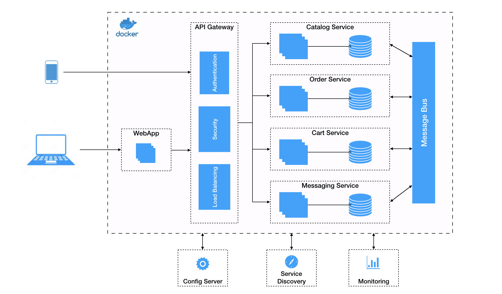

## Architecture



###  API Gateway

API gateway is implemented using Spring Cloud Gateway. It is the single entry point for all clients and routes request to different microservices running in the background based on URL pattern.

### Config server

Config server is implemented using Spring Cloud Config. It allows the microservices configuration to be stored on the centralized server, rather than with individual service.

### Service Discovery

Service registry and discovery is implemented using Netflix Eureka. It provides REST API for service registration management and for querying available instances. Netflix Ribbon is an IPC client that works with Eureka to load balance requests across the available service instances.

## Backend Microservices

### WebApp

WebApp serves the Angular UI component for the project. It integrates with PayPal Client API for payments.

### Catalog

The Catalog service consists of product catalog. It makes use of Spring Data JPA repositories to store data in in-memory H2 database.
Ideally it would use NoSQL and Elasticsearch to store and retrieve the information, but for the sake of simplicity, I have used in-memory database.

### Order 

Saves the order in in-memory H2 database using Spring Data JPA. It sends out order details in Kafka topic for the downstream apps to consume. Using Kafka, it de-couples the other downstream services and adds flexibility to the design. Downstream apps could serve multiple purposes like re-order inventory, send notifications, shipping, etc.

### Notification

Yet to be implemented. Sends out notification to the user. 


## Running Instructions
### Via Maven - spring boot

Download and start Kafka on the default port.

```bash
$ cd ecommerce-parent
$ mvn clean install
```
```bash
$ cd ecommerce-config
$ mvn spring-boot:run
```
```bash
$ cd ecommerce-discovery
$ mvn spring-boot:run
```
```bash
$ cd ecommerce-catalog
$ mvn spring-boot:run
```
```bash
$ cd ecommerce-app
$ mvn spring-boot:run
```
```bash
$ cd ecommerce-order
$ mvn spring-boot:run
```
```bash
$ cd ecommerce-gateway
$ mvn spring-boot:run
```

